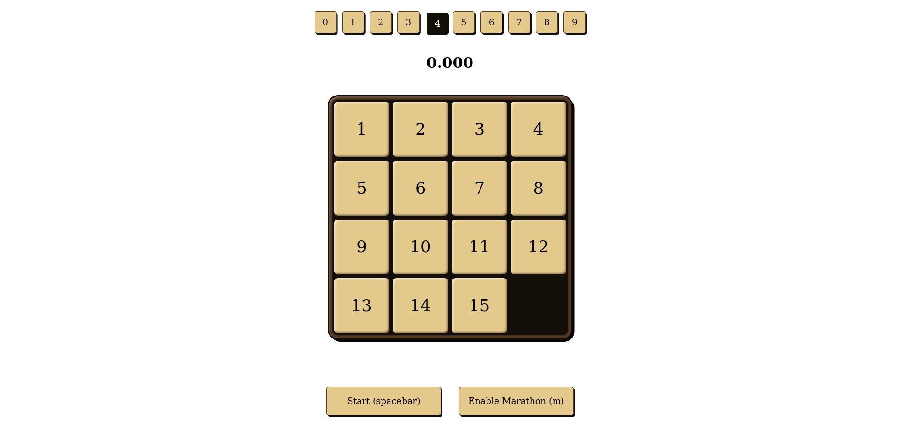
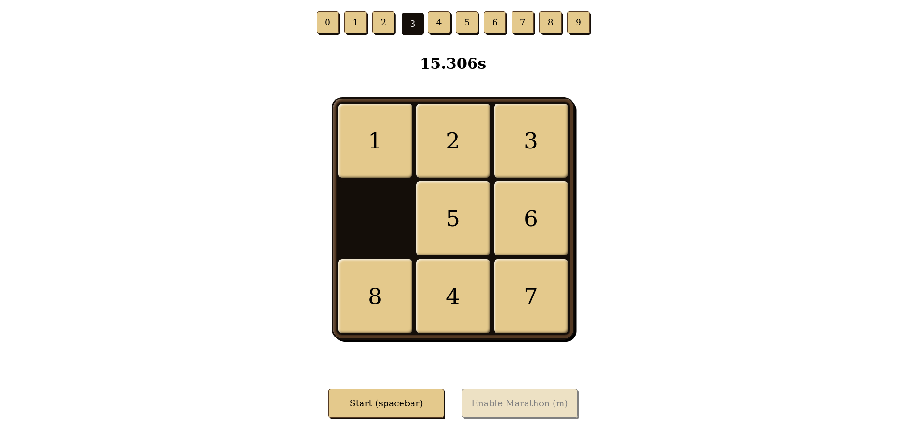
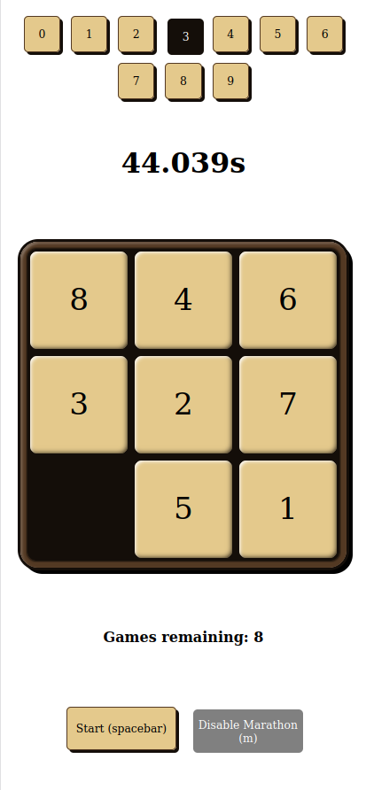
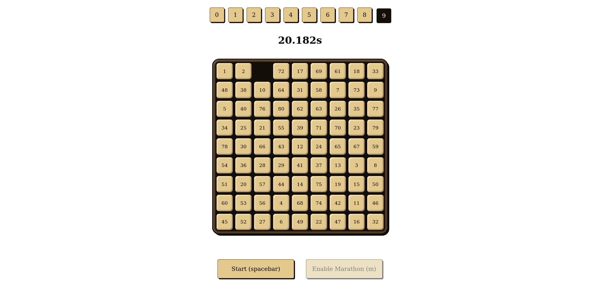

# [Link to play online - hosted on my github page](https://adambookout.github.io/fifteen/)

# fifteen

A 15-puzzle with support for other puzzle sizes!

### Instructions

Use the arrow keys or click the tiles to slide the blocks and get them back to
their original spots.

### Features

- Ridiculous amount of choice of puzzle sizes
- Marathon mode to see your average time for 10 games in a row (this is how the
  world record is counted)
- Mobile support
- Truly random algorithm (see below for details)

## Screenshots

---

---

---

---

Note: Some fifteen puzzle implementations randomize the board by starting with a
solved state and shuffling tiles around, which often leads to games that are
very close to being solved already. The randomization algorithm used in this
game works off the principle that 50% of random boards are solvable: it
randomizes the board, checks if it's solvable, and if not it reshuffles and
tries again. With a limit of 30 retries, there is a 1 in 2^30 chance that the
generated board will be unsolvable. Don't worry, you'll know if it is.
