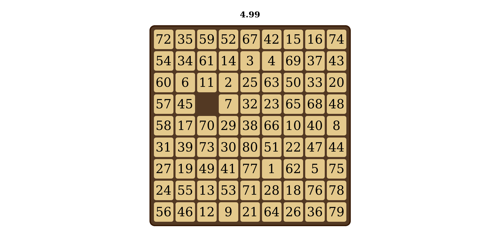

# [Link to play online - hosted on my github page](https://adambookout.github.io/fifteen/)

# fifteen
A simple, minimalistic 15-puzzle with support for other puzzle sizes!

### Instructions
Use the arrow keys to slide the blocks and get them back to their original
spots.

Spacebar to reset, number keys 0 thru 9 to select different puzzle sizes.

## Screenshots

---

---

---

Note: since the shuffling algorithm shuffles randomly and then checks if the board is solvable, there's a small chance that a puzzle will be unsolvable. Don't worry, you'll know if it is.
